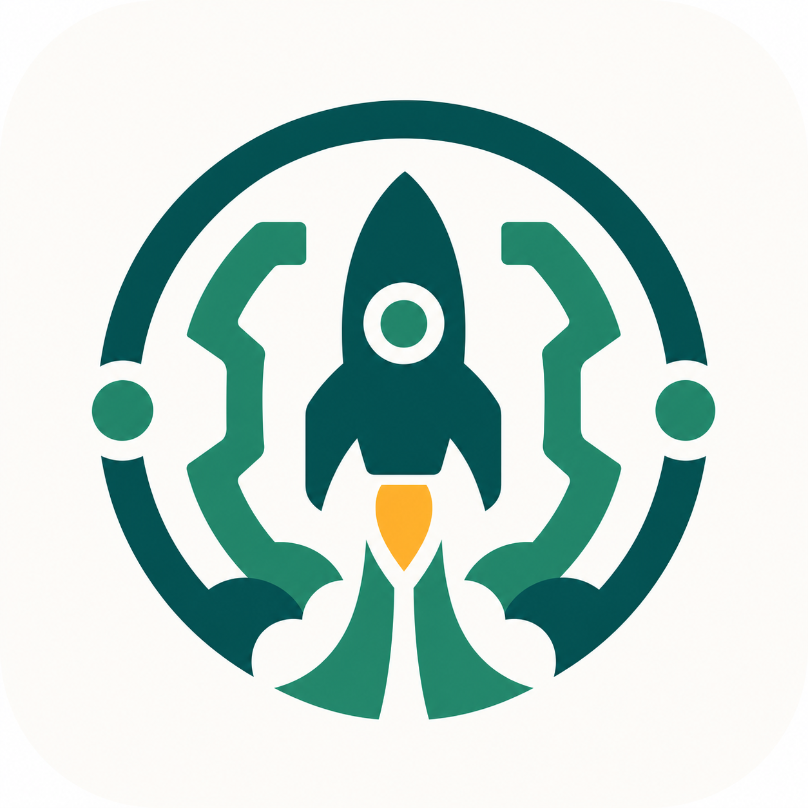

# Godot Launchpad



Godot Launchpad is an open-source desktop version manager for Godot. It checks
the latest stable Godot releases, installs the selected version in the
background, keeps a managed install folder, and launches Godot without sending
you through a browser download flow.

No manual zip juggling. No hunting for executables. Pick a version and get back
to making games.

## Highlights

- Auto-detects current stable Godot releases from `godotengine/godot`.
- Installs and extracts Godot inside the app.
- Remembers the default install folder, launch arguments, and installed versions.
- Launches managed Godot installs directly.
- Supports desktop builds for macOS, Windows, and Linux.

## Who It Is For

- Godot developers who switch between engine versions.
- Beginners who want a simpler Godot setup flow.
- Teams that want a consistent local Godot install location.
- Tinkerers who want a small, hackable Flutter desktop app.

## Current Status

Godot Launchpad is early open source software. The macOS desktop build is the
most tested path right now, with Windows and Linux project scaffolds included.

## Run From Source

```sh
flutter pub get
flutter run -d macos
```

For a debug app bundle:

```sh
LC_ALL=en_US.UTF-8 LANG=en_US.UTF-8 flutter build macos --debug
```

## Development

```sh
dart analyze lib/main.dart test/widget_test.dart
flutter test test/widget_test.dart
LC_ALL=en_US.UTF-8 LANG=en_US.UTF-8 flutter build macos --debug
```

## Contributing

Issues, bug reports, platform testing, and small pull requests are welcome.
Good first areas:

- Windows and Linux install validation
- Better installed-version management
- App icon and visual polish
- Release packaging

## License

MIT
